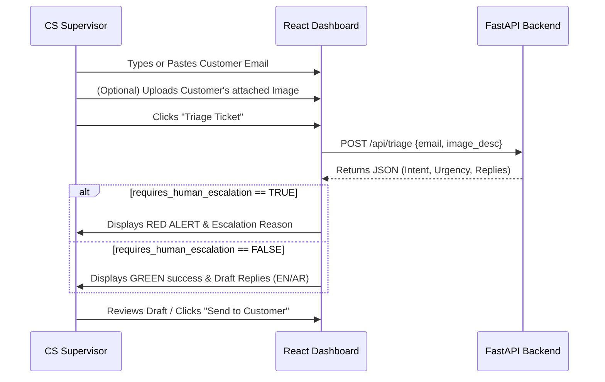
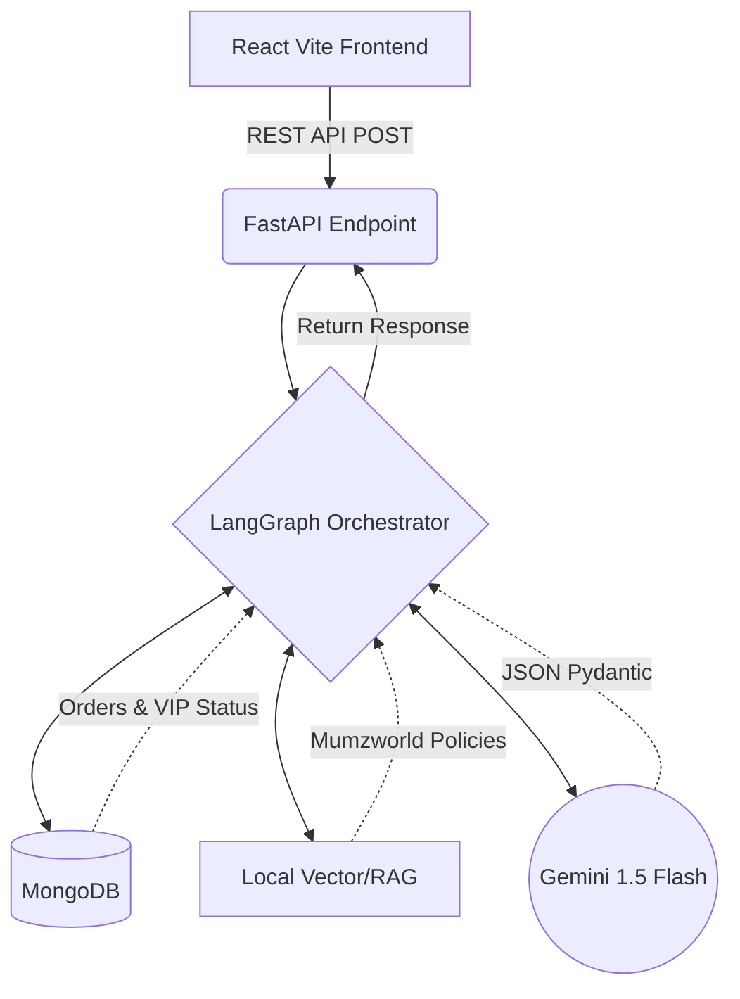

# AI Support Ticket Triage - Workflow & Architecture

This document tracks the end-to-end flows of our application, detailing how the user interacts with the system, and how the underlying nodes process information.

## 1. User Interface Flow (Frontend)
This is the flow experienced by the Mumzworld Customer Support supervisor interacting with our React Dashboard.



## 2. High-Level System Architecture
How the individual tech stack components interact.



## 3. Low-Level Agent Workflow (LangGraph)
This represents the explicit state transitions happening inside `agent.py`.

```mermaid
stateDiagram-v2
    [*] --> Node_Extract_Intent
    
    Node_Extract_Intent --> Node_Tool_DB_Lookup: Extracts "MW-XXXXX"
    
    Node_Tool_DB_Lookup --> Node_RAG_Policy: Injects Order & VIP Status
    
    Node_RAG_Policy --> Node_Vision_Check: Injects Policy Context
    
    Node_Vision_Check --> Node_Synthesize: Validates User Image Claims
    
    Node_Synthesize --> Output_Validation: Gemini formulates response
    
    state Output_Validation {
        direction LR
        Valid_JSON --> Complete
        Invalid_Format --> Re-prompt
    }
    
    Output_Validation --> Decision_Gate
    
    state Decision_Gate <<choice>>
    Decision_Gate --> Escalate_to_Human: High Anger/Medical/Uncertain
    Decision_Gate --> Standard_Auto_Reply: Confident && Safe
    
    Escalate_to_Human --> [*]
    Standard_Auto_Reply --> [*]
```

## Critical Decision Points in Synthesis:
- If `Order not found` -> **ESCALATE**.
- If `Hygiene Seal Broken` -> **Standard Auto Reply (Rejection)**.
- If `Customer mentions Rash/Choking` -> **ESCALATE (Safety Team)**.
- If `VIP User wants late return` -> **Standard Auto Reply (Approval)**.
