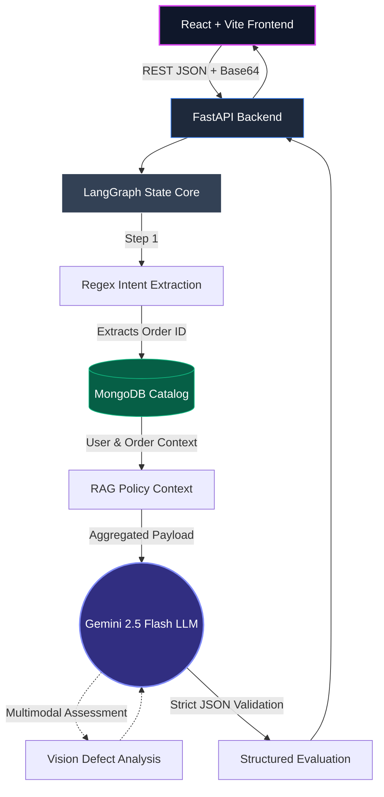

# Mumzworld AI: Agentic Triage Platform

A full-stack, asynchronous AI Customer Support system engineered specifically for **Mumzworld**. This application intercepts incoming support requests, cross-references local MongoDB clusters via a stateful **LangGraph** pipeline, evaluates distinct logistical edge cases, performs multimodal image analysis, and synthesizes structured JSON resolutions dynamically in real-time.

---

## ⚡ System Architecture

The pipeline leverages a decoupled React/Python architecture. Graph nodes execute deterministically to ensure accurate data retrieval and state management prior to LLM invocation.



---

## 🚀 Logistical Edge Cases & Validations
The routing engine natively monitors 10 distinct constraints, effectively suppressing LLM hallucination and enforcing precise warehouse/logistical rulesets:

1. **Medical Hazard Detection:** NLP logic identifies health-related keywords ("rash", "choking") and automatically overrides standard refund paths to invoke a human safety escalation.
2. **Algorithmic Fraud Prevention:** The backend queries the MongoDB user profile. If `total_returns_count > 3`, the return is intercepted and flagged for manual fraud review.
3. **Dynamic Logistics Routing:** If the DB query indicates item `weight_kg > 5.0`, standard courier fulfillment is suppressed in favor of `SCHEDULE_FREIGHT_PICKUP`.
4. **Temporal Warranty Validation:** Integrates `datetime.now()` to validate return windows. If a product exceeds standard return limits but falls within the MongoDB `warranty` integer constraint, intent is pivoted to `WARRANTY_CLAIM`.
5. **Geospatial Cross-Border Fees:** Validates `shipping_address`; non-domestic (KSA) targets generate an automated 50 AED cross-border deduction clause.
6. **Hygiene & Compliance Isolation:** Strict conditional rejection of returns involving open hygiene products (e.g., breast pumps, diapers) via RAG policy lookup.
7. **Gift-Transaction Handling:** `is_gift: true` boolean validations suppress traditional bank refunds, redirecting the capital to platform Wallet Credits.
8. **Wallet Liquidity Retention:** If `wallet_balance_aed > 0`, the LLM natively suggests wallet refunds to maintain circulating platform capital.
9. **Concurrency Blocking:** Database flags indicating `active_return: True` cause immediate interception, halting duplicate return generation.
10. **Inventory-Aware Exchanges:** Requesting an exchange on items with `in_stock: False` dynamically diffuses the request and reroutes the customer to a `STORE_CREDIT` resolution.

---

## 🎨 Frontend Architecture

- **WebGL Rendering:** Native `@react-three/fiber` integration utilizing abstract `Icosahedron` meshes bound to Framer Motion to visualize synchronous processing states.
- **Client-Side File Processing:** Native `FileReader` implementations enabling robust Base64 encoding for multimodal image uploads without requiring intermediary object storage pipelines.
- **CSS Architecture:** Tailwind v4 stack utilizing native CSS `@theme` variables for modular styling without complex Javascript configurations.
- **Bilingual NLP Synthesis:** The generative pipeline enforces strict synthesis of native Fusha Arabic RTL (Right-to-Left) alongside English output to ensure robust multi-regional deployability.

---

## 🛠️ Local Development Setup

### 1. Database & Environment Configuration
Ensure your `backend/.env` file contains your core Gemini Developer API key:
```bash
GEMINI_API_KEY="AIzaSyB49lVZ......"
```

Because the application relies on an internalized MongoDB mock for data integrity verification, you must synthetically seed it prior to your first execution. 
```bash
cd backend
python seed_db.py
```

### 2. Booting the FastAPI Backend
Start the Uvicorn terminal (running Python 3.12).
```bash
cd backend
python -m uvicorn main:app --host 0.0.0.0 --port 8000 --reload --env-file .env
```
👉 *You can verify server health via returning GET:* `http://localhost:8000/api/health`

### 3. Activating the React Dashboard
Open a secondary terminal process.
```bash
cd frontend
npm install
npm run dev
```
👉 *Dashboard will dynamically map to:* `http://localhost:5173`
