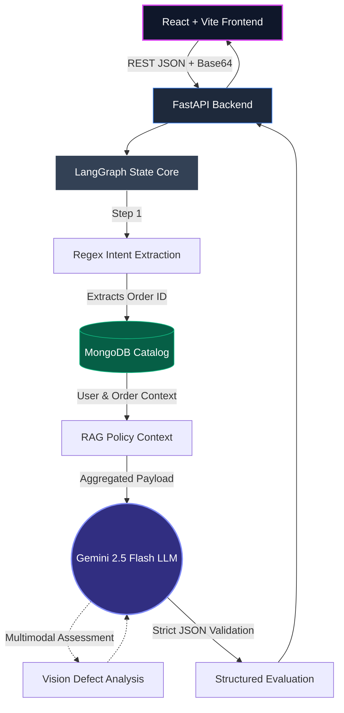

# Mumzworld AI: Agentic Triage Platform

A full-stack AI Customer Support prototype built for **Mumzworld**. It intercepts incoming support requests, cross-references a MongoDB catalog via a stateful **LangGraph** pipeline, handles multimodal image input, and returns structured JSON triage payloads with bilingual draft responses.

---

> [!IMPORTANT]
> **Challenge Grading Deliverables**
> - **Evaluations & Test Cases:** See [EVALS.md](./EVALS.md) for our full 10-case evaluation rubric, scores, and uncertainty handling.
> - **Tradeoffs & Architecture:** See [TRADEOFFS.md](./TRADEOFFS.md) for scope decisions, model rationale, and rejected concepts.

---

## 🌐 Live Deployments & Demonstration

- **Walkthrough Video:** [Watch the Prototype Walkthrough](https://drive.google.com/file/d/1ezWB1op4_ejJpfSK7vXUS479i4gGxfwO/view?usp=sharing)
- **Live React Frontend (Vercel):** [https://ai-support-system-three.vercel.app/](https://ai-support-system-three.vercel.app/)
- **Live FastAPI Backend (Railway):** [https://ai-support-system-production.up.railway.app/api/health](https://ai-support-system-production.up.railway.app/api/health)

---

## 📖 Project Context

### ❓ What is this?
The Mumzworld Agentic Triage System is an automated customer support prototype. It intercepts raw customer complaint emails, analyzes uploaded images of damaged products using computer vision, queries MongoDB to verify order parameters, and uses a stateful logic graph to output deterministic logistics commands alongside bilingual draft responses.

### 🎯 Why did we build this?
Traditional e-commerce support pipelines rely heavily on human agents manually cross-referencing return policies against logistics databases. This causes slow resolution times and the risk of approving fraudulent returns. By building a triage layer, the AI handles the heavy lifting — extracting order IDs, checking policies, and flagging risk — before handing a structured ticket to a human agent for review.

### 🏗️ How was it built?
This distributed application safely isolates the intelligence layer from the frontend interface using a modern architecture:
- **Orchestration:** A Python-based **LangGraph** pipeline enforcing deterministic, cyclic state management.
- **Intelligence:** Google's natively multimodal **Gemini 2.5 Flash** integrated via LangChain with a 3-tier cascade fallback (OpenRouter → Z.AI).
- **Backend Infrastructure:** A robust **FastAPI** REST interface running on Uvicorn, simulating live data aggregations from a local **MongoDB** (pymongo) persistence layer.
- **Client Application:** A stateless **React + Vite** frontend natively utilizing **Tailwind v4** and **WebGL (@react-three/fiber)** for high-fidelity state visualizations and Base64 image parsing.

---

## ⚡ System Architecture

The pipeline leverages a decoupled React/Python architecture. Graph nodes execute deterministically to ensure accurate data retrieval and state management prior to LLM invocation.



---

## 🚀 Logistical Edge Cases & Validations
The routing engine natively monitors 10 distinct constraints, effectively suppressing LLM hallucination and enforcing precise warehouse/logistical rulesets:

1. **Medical Hazard Detection:** NLP logic identifies health-related keywords ("rash", "choking") and automatically overrides standard refund paths to invoke a human safety escalation.
2. **Algorithmic Fraud Prevention:** The backend queries the MongoDB user profile. If `total_returns_count > 3`, the return is intercepted and flagged for manual fraud review.
3. **Dynamic Logistics Routing:** If the DB query indicates item `weight_kg > 5.0`, standard courier fulfillment is suppressed in favor of `SCHEDULE_FREIGHT_PICKUP`.
4. **Temporal Warranty Validation:** Integrates `datetime.now()` to validate return windows. If a product exceeds standard return limits but falls within the MongoDB `warranty` integer constraint, intent is pivoted to `WARRANTY_CLAIM`.
5. **Geospatial Cross-Border Fees:** Validates `shipping_address`; non-domestic (KSA) targets generate an automated 50 AED cross-border deduction clause.
6. **Hygiene & Compliance Isolation:** Strict conditional rejection of returns involving open hygiene products (e.g., breast pumps, diapers) via RAG policy lookup.
7. **Gift-Transaction Handling:** `is_gift: true` boolean validations suppress traditional bank refunds, redirecting the capital to platform Wallet Credits.
8. **Wallet Refund Preference:** If `wallet_balance_aed > 0`, the LLM suggests a wallet refund rather than a bank transfer, which is faster for the customer.
9. **Concurrency Blocking:** Database flags indicating `active_return: True` cause immediate interception, halting duplicate return generation.
10. **Inventory-Aware Exchanges:** Requesting an exchange on items with `in_stock: False` dynamically diffuses the request and reroutes the customer to a `STORE_CREDIT` resolution.

---

## 🎨 Frontend Architecture

- **WebGL Rendering:** Native `@react-three/fiber` integration utilizing abstract `Icosahedron` meshes bound to Framer Motion to visualize synchronous processing states.
- **Client-Side File Processing:** Native `FileReader` implementations enabling robust Base64 encoding for multimodal image uploads without requiring intermediary object storage pipelines.
- **CSS Architecture:** Tailwind v4 stack utilizing native CSS `@theme` variables for modular styling without complex Javascript configurations.
- **Bilingual NLP Synthesis:** The generative pipeline enforces strict synthesis of native Fusha Arabic RTL (Right-to-Left) alongside English output to ensure robust multi-regional deployability.

---

## 🛠️ Local Development Setup

### 1. Database & Environment Configuration
Ensure your `backend/.env` file contains your core Gemini Developer API key:
```bash
GEMINI_API_KEY="AIzaSyB49lVZ......"
```

Because the application relies on an internalized MongoDB mock for data integrity verification, you must synthetically seed it prior to your first execution. 
```bash
cd backend
python seed_db.py
```

### 2. Booting the FastAPI Backend
Start the Uvicorn terminal (running Python 3.12).
```bash
cd backend
python -m uvicorn main:app --host 0.0.0.0 --port 8000 --reload --env-file .env
```
👉 *You can verify server health via returning GET:* `http://localhost:8000/api/health`

### 3. Activating the React Dashboard
Open a secondary terminal process.
```bash
cd frontend
npm install
npm run dev
```
👉 *Dashboard will dynamically map to:* `http://localhost:5173`

---

## 🤖 Tooling & Transparency

In the spirit of complete transparency for this challenge, here is the exact tooling stack used to build this repository:

- **AI Assistants Used:** The vast majority of this infrastructure (FastAPI, LangGraph orchestration, React Three Fiber UI, and Cloud Deployment configuration) was pair-programmed and architected using **Google DeepMind's Antigravity Agent**.
- **Models Used:**
  - `gemini-2.5-flash` (Primary Intelligence & Vision via Native API)
  - `google/gemma-3-12b-it:free` (Secondary Vision Fallback via OpenRouter)
  - `glm-4.7-flash` (Tertiary Text Fallback via Z.AI)
- **Harnesses & Frameworks:** LangGraph (State orchestration), Pydantic (Strict schema validation), Vite + React (Frontend), Tailwind v4 (Styling), MongoDB Atlas (RAG Database).
